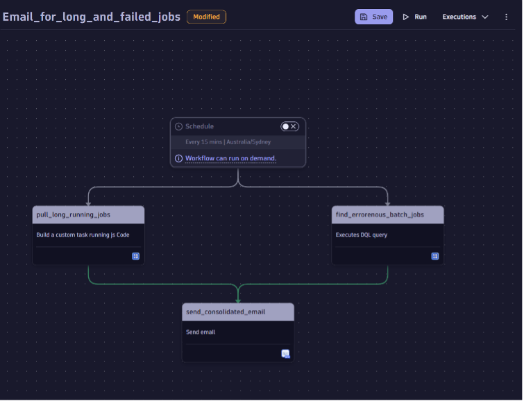

## Beyond Insights: Alerts and Orchestration for Business-Critical Jobs

While dashboards provide valuable insights into batch jobs, this can be extended to receive alerts for long-running or failed jobs. Additionally, orchestration and complete automation can be achieved using Dynatrace's `Hypermodel AI` and `Context-aware` analysis, enabling automated actions based on these insights. 

### Workflow to alert on long-running or failed jobs.  
Although Dynatrace's AI can automatically detect and alert on job duration anomalies or increased failure rates, for business-critical jobs, this can be managed more effectively through a workflow, as illustrated   

### Orchestration of the BatchJobs  
Batch job management can be efficiently orchestrated using workflows and predictive analysis to schedule and run jobs optimally. With Davis AI identifying root causes, workflows can be used to stop erroneous batch executions.  

Additionally, Davis Prediction analysis in conjunction with workflow can act to reschedule or paused jobs to ensure optimal resource utilization, preventing any negative impact on the application landscape.  

