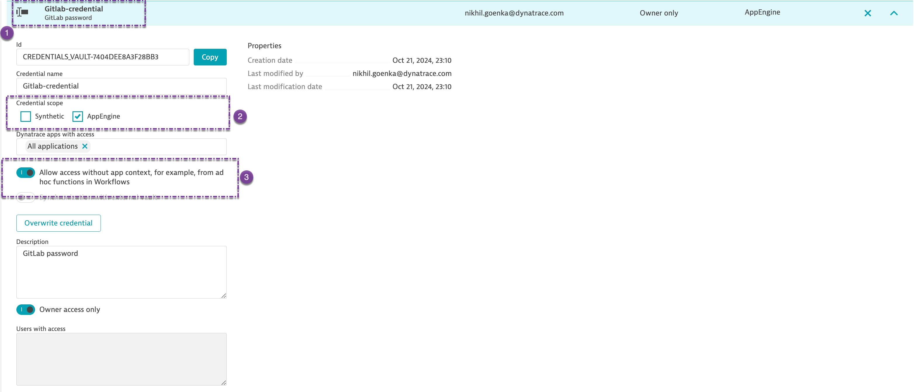

# GitLab Metrics and Events Collection Workflow

This workflow is designed to collect various metrics and event data from GitLab projects and pipelines, process it, and ingest the data into Dynatrace as business events. This allows teams to monitor GitLab project activity, pipeline performance, repository storage usage, merge request cycle time, and contributor engagement within the Dynatrace environment.

## Workflow Overview

The workflow will:
1. **Fetch Project List**: Retrieve all GitLab projects the authenticated user has access to.
2. **Gather Project Metrics**:
   - **Merge Request Cycle Time**: Average time taken for merge requests to move from creation to merging over the last 30 days.
   - **Repository Storage Usage**: Storage used by the repository.
   - **Active Contributors**: Total number of contributors.
3. **Collect Pipeline Data**:
   - Collect metrics for pipelines created in the last 60 minutes, including pipeline status, duration, and timestamps.
4. **Process Pipeline Jobs**:
   - For each pipeline, gather job-level data (status, duration, stage, etc.) for granular insights.

### Events and Metrics

- **Project Metrics**:
  - Merge Request Cycle Time
  - Repository Storage Usage
  - Active Contributors

- **Pipeline and Job Metrics**:
  - Pipeline Status, Duration, and Start/End Times
  - Job Status, Duration, and Stage

These metrics are ingested and accessible as business events.

## Requirements

1. **GitLab Credentials**: The workflow requires a GitLab API token stored in Dynatrace Credentials Vault with the name `Gitlab-credential`.
   - This credential should contain the following information:
     - **Project Token**

   To create this credential in Dynatrace:
   - Navigate to **Settings > Integration > Credentials** in your Dynatrace environment.
   - Add a new credential with the name **Gitlab-credential**.
   - Store your GitLab named **Gitlab-credential** with appropriate scopes.

### API Scopes Required

- GitLab API token with access to the following GitLab endpoints:
  - **Projects API**: To list accessible projects.
  - **Merge Requests API**: To fetch merge request details for calculating cycle time.
  - **Pipelines API**: To retrieve pipeline data.
  - **Repository API**: For project storage and contributors' information.

## How to get started 

1. Setup a credentials on Dynatrace as illustrated in the image below.   
2. **Upload the workflow** as mentioned [here](https://docs.dynatrace.com/docs/shortlink/workflows-manage#upload-a-workflow-or-a-template)  
3. After the 1st run, it will report metrics as **bizevents** and available on dashboard    
 
# Example Ingested Data  
## Project Metrics  
```json
{
  "event.provider": "gitlabMetrics",
  "event.type": "projectMetrics",
  "project-id": "123",
  "project-name": "example-project",
  "merge-request-cycle-time": 24.5,
  "repository-storage-usage": 1048576,
  "active-contributors": 10
}
```

## Pipeline Metrics  
```
fetch bizevents, scanLimitGBytes:-1
| filter event.provider == "gitlabPipeline" and event.type == "pipeline"
```  

``` json
{
  "event.provider": "gitlabMetrics",
  "event.type": "pipelineMetrics",
  "project-id": "123",
  "project-name": "example-project",
  "pipeline-id": "456",
  "pipeline-status": "success",
  "pipeline-duration": 300,
  "pipeline-created_at": "2024-10-25T12:00:00Z",
  "pipeline-updated_at": "2024-10-25T12:05:00Z"
}
```

## Job Metrics Event  
These are accessible via DQL  

```
fetch bizevents, scanLimitGBytes:-1
| filter event.provider=="gitlabPipeline" and event.type == "job"
```  
``` json
{
  "event.provider": "gitlabJob",
  "event.type": "job",
  "project-id": "123",
  "project-name": "example-project",
  "pipeline-id": "456",
  "job-id": "789",
  "job-name": "build-job",
  "job-status": "success",
  "job-duration": 120,
  "job-stage": "build"
}
```


